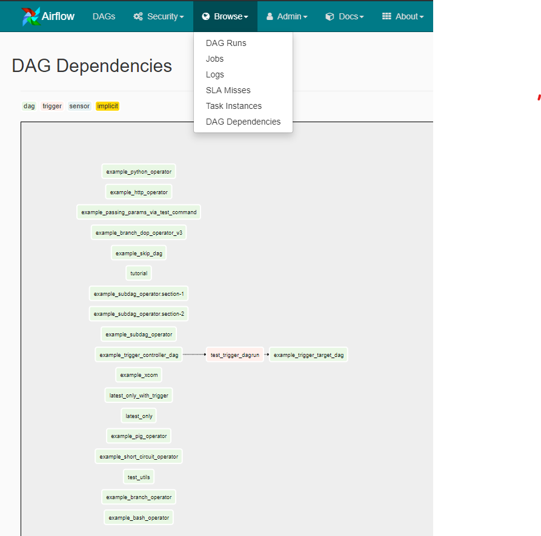

# Airflow DAG Dependencies

* Visualize dependencies between your Airflow DAGs
* 3 types of dependencies supported:
  * Trigger - `TriggerDagRunOperator` in DAG A triggers DAG B
  * Sensor - `ExternalTaskSensor` in DAG A waits for (task in) DAG B
  * Implicit - provide the ids of DAGs the DAGs depends on as an attribute named `implicit_dependencies`.
  For example `dag.implicit_dependencies = ['dag_1', 'dag_2']`  
* Be careful if you have 1000s of DAGs, might not scale.

## Installation

Copy `dag-dependencies-plugin` to Airflow plugin folder and you're ready to go

Only RBAC UI is supported.